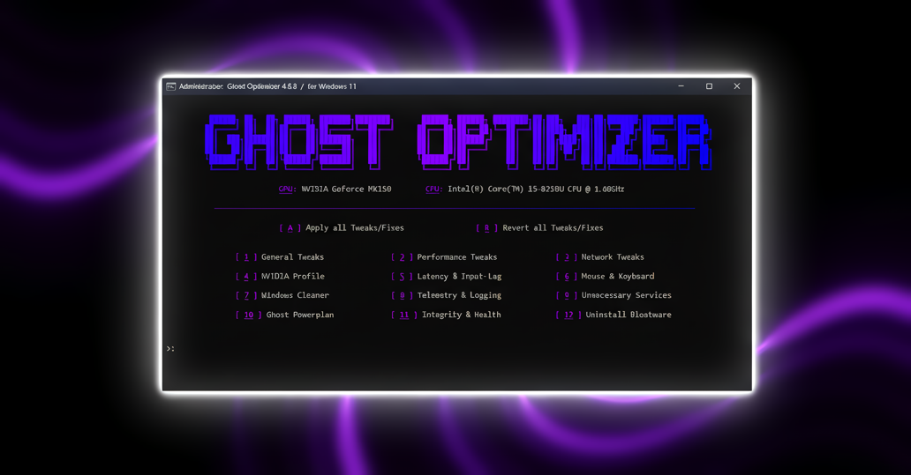

# 💜 About
**Ghost Optimizer** is a lightweight, open-source tweaker/optimizer that **improves performance** (FPS), **network speed** (ping), **reduces latency** (input lag), **disables telemetry** and **data collection** to **protect your privacy** and **fixes system integrity**.  

# 💻 Requirements
- Windows **10 22H2** / **11 25H2**  
- Administrator privileges  
- Internet connection  

# 🤝 Credits
Special thanks to [Opendows](https://github.com/MarcoRavich/Opendows) for listing this project and to [MysteryNich](https://github.com/MysteryNich) for testing each release.  
Some software and parts of the code were adapted from other developers, with proper credits included in the script comments.

# 📜 License
**Ghost Optimizer** is released under the [MIT License](LICENSE), allowing open use, modification, and distribution with attribution.  
If you create derivative work or redistribute this project, please maintain proper credit to the original authors.   

# ❓ How to Use
1. Go to [Releases](https://github.com/louzkk/Ghost-Optimizer/releases) page  
2. Download **Ghost Optimizer.bat**  
3. Run **Ghost Optimizer.bat** as **Administrator**  
*(You may need to temporarily disable your antivirus)*

# 🚨 Disclaimer
Use this script at your own risk — I take no responsibility for any damage or data loss. Performance improvements may vary depending on your hardware and usage; check the [Guide](GUIDE.md) for more information.

# 💬 Bug or Suggestion
Send me a message on [Discord](https://github.com/louzkk) or [Open an Issue](https://github.com/louzkk/Ghost-Optimizer/issues).