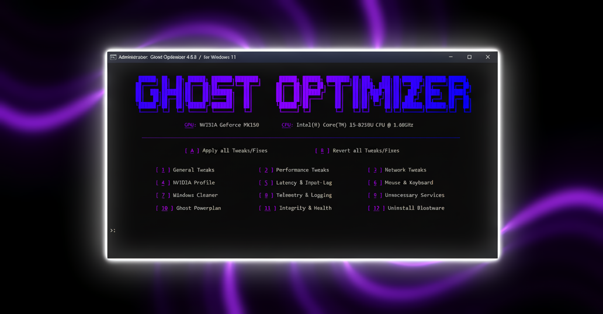

# 💜 About
**Ghost Optimizer** is an open source advanced Windows 10/11 optimization script that improves **performance**, **latency**, **network** and **privacy**, while disabling **telemetry**, **bloatware** and **AI** features.

[](https://github.com/louzkk/Ghost-Optimizer)
[](https://github.com/louzkk/Ghost-Optimizer/releases)
 
       

<details>
<summary>See tweaks impact</summary>

| Area | Impact |
|---|---|
| General Performance | ↑ 5–30% |
| General Latency | ↓ 5–30% |
| Network Latency | ↓ 5–30% |
| Idle Resource Usage | ↓ 20–60% |
| Bloatware & AI | ↓ 80–90% |
| Non-essential services | ↓ 50–80% |
| Telemetry & Tracking | ↓ 80–90% |

*Approximate values. Results vary by hardware, drivers and Windows version.*  
</details>

# 💻 Requirements
- Windows 10 or 11
- Administrator privileges
- Internet connection

# 📥 Download
**Manual** — Download [Ghost-Optimizer.bat](https://github.com/louzkk/Ghost-Optimizer/releases) and run as **Administrator**.

**Quick** — Open PowerShell as **Administrator** and run:

```
PowerShell -ExecutionPolicy Bypass -Command "if (!(Get-Command git -ErrorAction SilentlyContinue)) { Write-Host 'Downloading Ghost Optimizer...'; start-process winget -ArgumentList 'install --id Git.Git -e --source winget --silent' -Wait }; Remove-Item '$env:TEMP\Ghost' -Recurse -Force -ErrorAction SilentlyContinue; git clone https://github.com/louzkk/Ghost-Optimizer.git '$env:TEMP\Ghost'; Set-Location '$env:TEMP\Ghost\bin'; .\Ghost-Optimizer.bat"
```

# 🤝 Credits
Project listed on [Opendows](https://github.com/MarcoRavich/Opendows). Thanks to [@MysteryNich](https://github.com/MysteryNich) for testing each release.  
Some software and parts of the code were adapted from other developers.

# 🚨 Disclaimer
Use at your own risk. I'm not responsible for any damage, instability or data loss.  
**Need help?** See the [Troubleshooting & Notes](https://github.com/louzkk/Ghost-Optimizer/blob/main/GUIDE.md) page.

# 📜 License
[MIT License](LICENSE) — open use, modification and distribution with attribution.

# 💬 Feedback
You can [Open an issue](https://github.com/louzkk/Ghost-Optimizer/issues) or add me on Discord (@louzkk).